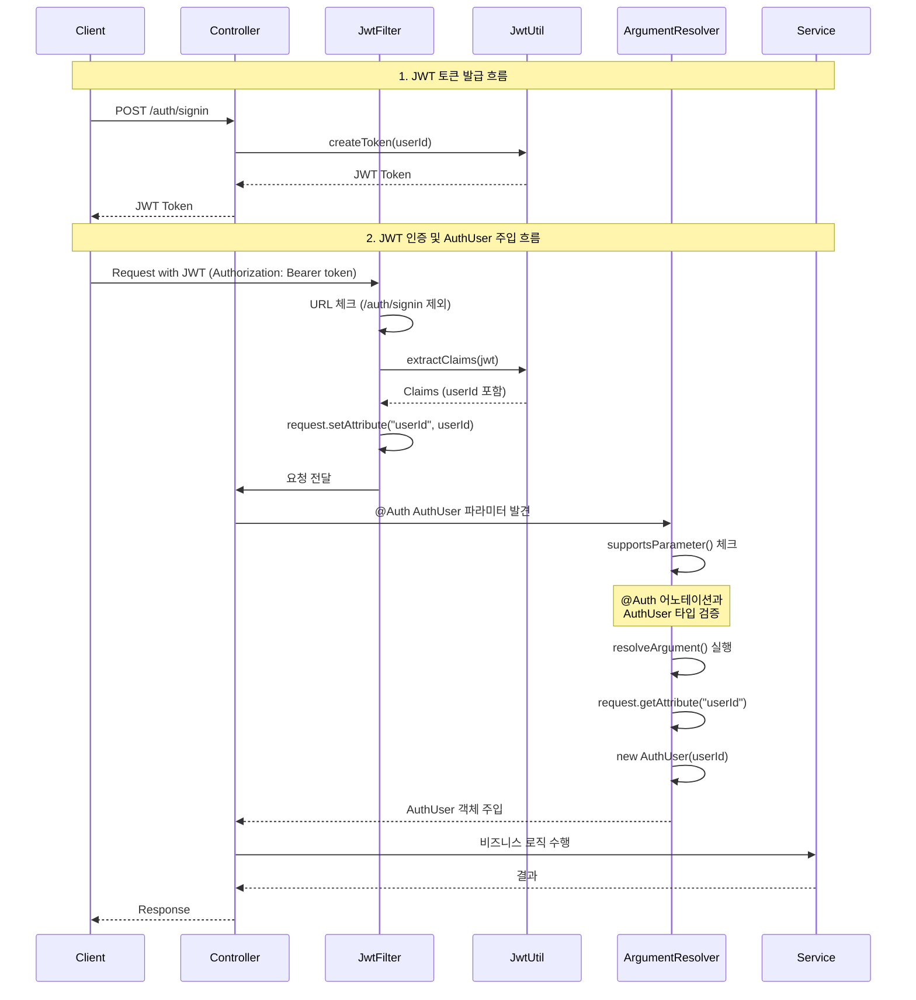

# Argument Resolver Playground

Spring Boot ArgumentResolver 학습을 위한 프로젝트입니다.

## 프로젝트 개요

이 프로젝트는 Spring의 HandlerMethodArgumentResolver를 활용하여 커스텀 어노테이션 기반의 파라미터 바인딩을 구현하고 테스트하는 강의 자료입니다.

## 구현된 ArgumentResolver

### 1. CustomPathVariableArgumentResolver
- **어노테이션**: `@CustomPathVariable`
- **용도**: URL 경로 변수를 커스텀하게 처리
- **예시**: `/custom/path/{name}` → `@CustomPathVariable("name") String name`

### 2. CustomRequestParamArgumentResolver
- **어노테이션**: `@CustomRequestParam`
- **용도**: 요청 파라미터를 커스텀하게 처리
- **예시**: `/custom/request?name=value` → `@CustomRequestParam("name") String name`

### 3. CustomSessionAttributeArgumentResolver
- **어노테이션**: `@CustomSessionAttribute`
- **용도**: 세션 속성을 커스텀하게 처리
- **예시**: `@CustomSessionAttribute("hello") String sessionValue`

### 4. AuthUserArgumentResolver
- **어노테이션**: `@Auth`
- **용도**: JWT 토큰에서 추출한 사용자 정보를 자동으로 주입
- **예시**: `@Auth AuthUser authUser`

## JWT 인증 흐름



## JWT 인증 상세 흐름

### 1. 토큰 발급 (/auth/signin)
```java
// AuthTestController.java
@PostMapping("/auth/signin")
public String signin() {
    return jwtUtil.createToken(1L);  // userId: 1로 JWT 생성
}
```

### 2. JwtFilter 동작
```java
// JwtFilter.java
// 1) Authorization 헤더에서 토큰 추출
String bearerJwt = httpRequest.getHeader("Authorization");

// 2) 토큰 검증 및 Claims 추출
Claims claims = jwtUtil.extractClaims(jwt);

// 3) userId를 request attribute에 저장
httpRequest.setAttribute("userId", Long.parseLong(claims.getSubject()));
```

### 3. AuthUserArgumentResolver 동작
```java
// AuthUserArgumentResolver.java
// 1) @Auth 어노테이션과 AuthUser 타입 체크
public boolean supportsParameter(MethodParameter parameter) {
    boolean hasAuthAnnotation = parameter.getParameterAnnotation(Auth.class) != null;
    boolean isAuthUserType = parameter.getParameterType().equals(AuthUser.class);
    
    if (hasAuthAnnotation != isAuthUserType) {
        throw new IllegalStateException("@Auth와 AuthUser 타입은 함께 사용되어야 합니다.");
    }
    return hasAuthAnnotation;
}

// 2) request attribute에서 userId 추출하여 AuthUser 생성
public Object resolveArgument(...) {
    Long userId = (Long) request.getAttribute("userId");
    return new AuthUser(userId);
}
```

### 4. Controller에서 사용
```java
// AuthTestController.java
@GetMapping("/auth/test")
public String auth(@Auth AuthUser authUser) {
    return "authUser.getId(): " + authUser.getId();
}
```

## 주요 구성 요소

### Filter
- **JwtFilter**: 모든 요청에 대해 JWT 토큰을 검증하고 userId를 추출
  - `/auth/signin`, `/custom/*`, `/session` 경로는 JWT 검증 제외

### Configuration
- **WebConfig**: 모든 ArgumentResolver 등록
- **FilterConfig**: JwtFilter 등록

### Util
- **JwtUtil**: JWT 토큰 생성 및 검증 유틸리티

## 테스트 실행

```bash
./gradlew test
```

## API 예제

### 1. JWT 토큰 발급
```bash
curl -X POST http://localhost:8080/auth/signin
# Response: eyJhbGciOiJIUzI1NiJ9...
```

### 2. 인증된 요청
```bash
curl -H "Authorization: Bearer {JWT_TOKEN}" http://localhost:8080/auth/test
# Response: authUser.getId(): 1
```

### 3. 커스텀 ArgumentResolver 테스트 (JWT 불필요)
```bash
# PathVariable
curl http://localhost:8080/custom/path/testuser
# Response: Custom Path Variable: testuser

# RequestParam
curl http://localhost:8080/custom/request?name=testuser
# Response: Custom Request Param: testuser
```

## 프로젝트 구조

```
src/main/java/com/example/argumentresolverplayground/
├── annotation/           # 커스텀 어노테이션
│   ├── Auth.java
│   ├── CustomPathVariable.java
│   ├── CustomRequestParam.java
│   └── CustomSessionAttribute.java
├── config/              # 설정 클래스
│   ├── FilterConfig.java
│   └── WebConfig.java
├── controller/          # 컨트롤러
│   ├── AuthTestController.java
│   ├── CustomPathVariableController.java
│   ├── CustomRequestParamController.java
│   └── CustomSessionController.java
├── dto/                 # DTO
│   └── AuthUser.java
├── filter/              # 필터
│   ├── JwtFilter.java
│   └── JwtUtil.java
└── resolver/            # ArgumentResolver
    ├── AuthUserArgumentResolver.java
    ├── CustomPathVariableArgumentResolver.java
    ├── CustomRequestParamArgumentResolver.java
    └── CustomSessionAttributeArgumentResolver.java
```

## 학습 포인트

1. **HandlerMethodArgumentResolver 인터페이스 구현**
   - `supportsParameter()`: 파라미터 지원 여부 판단
   - `resolveArgument()`: 실제 파라미터 값 생성

2. **JWT 기반 인증 구현**
   - Filter에서 토큰 검증 및 사용자 정보 추출
   - ArgumentResolver에서 자동 주입

3. **커스텀 어노테이션 활용**
   - 반복되는 파라미터 처리 로직을 어노테이션으로 추상화
   - 깔끔한 컨트롤러 코드 작성

## 참고사항

- Spring Boot 3.4.3 기반
- Java 17 이상 필요
- JWT 라이브러리: io.jsonwebtoken (jjwt) 사용